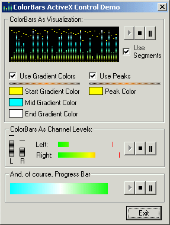

<div align="center">

## ColorBar Control


</div>

### Description

This control can be a level meter (with peaks) for visualizations, a seekbar, a progress bar, or just a gradient/solid line. I consider this control to now be in beta so feedback with regard to bugs encountered, optimizations, enchancements, feature suggestions/requests are most desired. I would also like to hear suggestions on how I can improve the gradient routines. I know some excellent gradient routines have been posted recently, especially Light Templer's/LaVolpe's, but they are only 2 color and I have struggled with integrating them into my control...any help would be welcome and appreciated.
 
### More Info
 


<span>             |<span>
---                |---
**Submitted On**   |2004-11-23 15:56:10
**By**             |[AlT](https://github.com/Planet-Source-Code/PSCIndex/blob/master/ByAuthor/alt.md)
**Level**          |Intermediate
**User Rating**    |4.9 (49 globes from 10 users)
**Compatibility**  |VB 6\.0
**Category**       |[Custom Controls/ Forms/  Menus](https://github.com/Planet-Source-Code/PSCIndex/blob/master/ByCategory/custom-controls-forms-menus__1-4.md)
**World**          |[Visual Basic](https://github.com/Planet-Source-Code/PSCIndex/blob/master/ByWorld/visual-basic.md)
**Archive File**   |[ColorBar\_C18211511232004\.zip](https://github.com/Planet-Source-Code/alt-colorbar-control__1-57384/archive/master.zip)

### API Declarations

```
LineTo
MoveToEx
Rectangle
SetPixel
```


